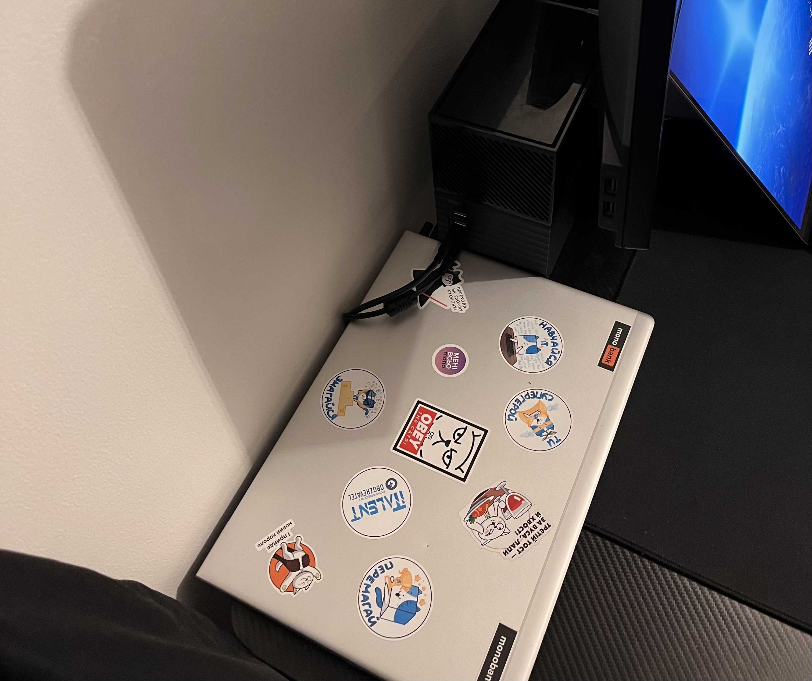
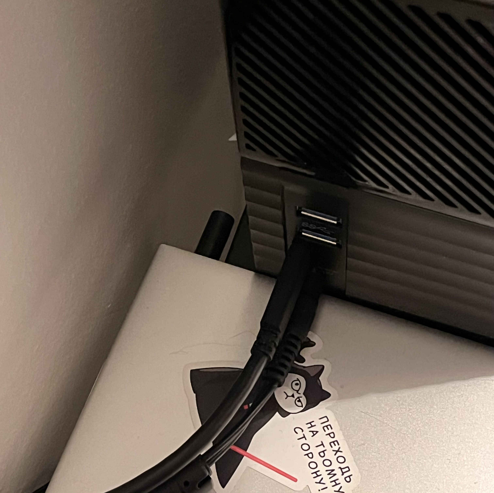
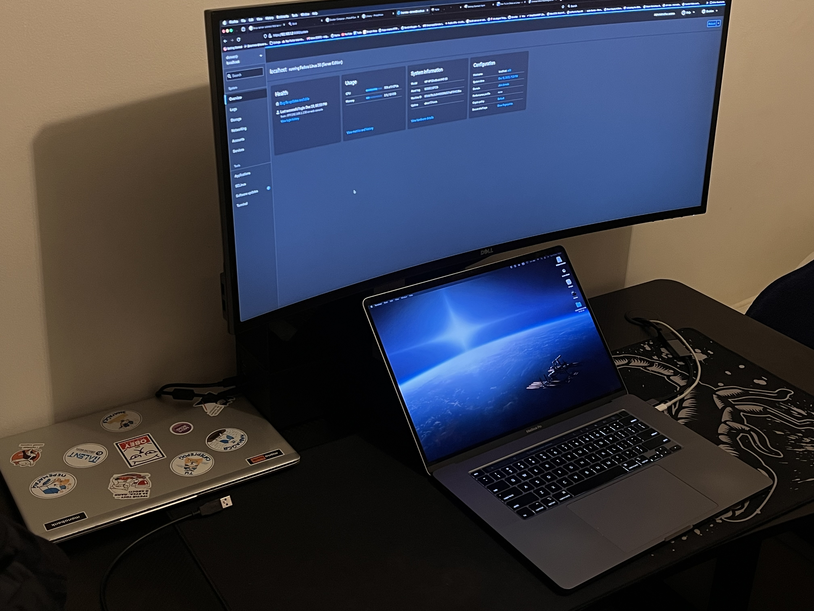

+++
title = "HomeLab #1"
date = "2023-12-20"
+++

Hey, this is my second post, and I'm going to talk about my homelab in this HomeLab series.  
Because I think anyone who making some projects should have or at least know try to use a homelab because it gives you completly new experience and opportunities.  

Now just a quick `disclaimer`, I'm not an expert in DevOps and System Administration stuff, so I might do something wrong, but I'm trying to learn and improve my skills, so if you have any suggestions or recommendations please let me know via github issues, email or telegram.  

Also my homelab consists of only one server(laptop) at this stage, so it's not a 'complete' homelab, but I'm planning to upgrade it in the future.  

## Hardware
At the moment I have only one server, but considering to upgrade in the future. 
This server runs on my old laptop HP EliteBook G5 840 which has:
- Intel Core i7-8550U (8) @ 4.000GHz
- Intel UHD Graphics 620
- 16GB RAM
- SSD KXG50ZNV256G TOSHIBA

And as it was a normal laptop that I used for work it has `Windows 11` installed on it as well as `Fedora Linux 38(Server Edition)` as a `dual boot`.

It all located in my room on the working desk and connected to the router via WiFi as I don't have an ethernet cable in my room.  
</img>  

And it looks quite well and clean for me, but if I will upgrade architecture then I will move it to the garage(might affect on internet connection) or pantry, best thing here is cable management:  
</img>  

Desk:  
</img>  

## Additional Hardware 
- External Samsung SSD 860 PRO (256GB) - which is using for small backups and running some containers that need to be fast.
- External HDD WD My Book Duo (3TB + 3TB in Mirror Raid (1)) - which is using for storing old photos and videos as well as backups, music, and some other stuff.

## Software
As I mentioned before I have `Windows 11` and `Fedora Linux 38(Server Edition)` installed on my laptop, but mainly I'm using `Fedora Linux 38(Server Edition)` as my main server OS.  
And Obviously, I'm using `Docker` and `Docker Compose` to run all the containers that I need, it includes:
- `Yacht` - which is a web interface for managing docker containers.
- `Uptime Kuma` - which is a web interface for monitoring docker containers.
- [Passport MFA Bot](https://github.com/denver-code/passport-status-bot) - which is a telegram bot that I use for tracking my passport application status.
- `NextCloud` - which is a cloud storage that I sue for accessing my files from "My Book Duo"
- And a couple of other pet-projects.

And at the moment all running just through `docker-compose` command right on Fedora Linux, but I'm planning to use some sort of management tool.

## Cons
Due to the fact that I'm not an expert in DevOps and System Administration stuff I have done something wrong and have some issues with my server like not being able to access it even from my local network, after few tries or few `ping` requests it starts working again, but I'm not sure what is the reason for that.  

Other problem is scalability, while laptop has enough resources for my current needs, it has poorly managed software environment and security.

## Upcoming Plans to Improve Architecture
1. I might buy a new server, it's could be either a desktop pc, rack server or microboard computer like Raspberry Pi.
2. Installing `Proxmox` to manage VM's.
3. Installing `Kubernetes` to manage containers.
5. Installing `Portainer` to manage containers. (?)
4. Installing `Traefik` to manage reverse proxy.
5. Adding local DNS server to manage .local or .home domains.
6. Adding `Pi-Hole` to manage DNS and block ads. (Possibly merge with local DNS server)
7. Adding TrueNAS/NextCloud to manage files.
8. Get new router to manage local network, as my current ISP is BT and their BT Hub is not good enough for my needs, and also as far as I know it's not possible to get a static IP from them, not sure about Business plans, but I don't want to pay more for that, considering to switch to other ISP.
9. Setup VPN server to access my local network from outside.
10. Setup `Grafana` to monitor my server. (?)

It all will be done in next couple of weeks, so stay tuned for updates, I might create a new post for each step as well as start a youtube channel to show how to do it.

## Research
- `Ansible` - for configuration management.
- Cheap way to get static IP and server equipment.
- Best homelab architecture.