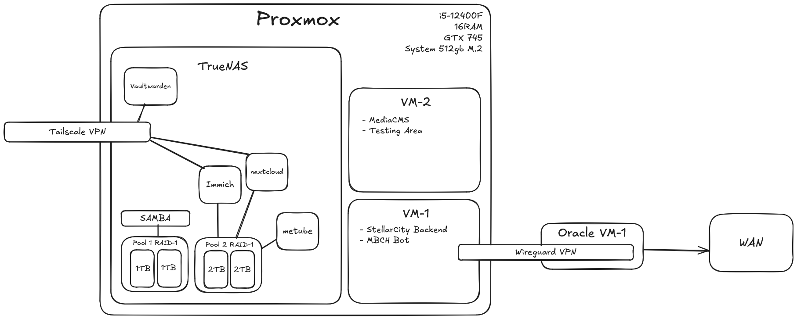

+++
title = "HomeLab 2.0"
date = "2024-12-26"
+++
Long story short, few months ago I've upgraded my home server and now I'm ready to share my new setup with you.

Now just a quick `disclaimer`, I'm not an expert in DevOps and System Administration stuff, so I might do something wrong.

Let's go through main components of my HomeLab 2.0.

## Hardware
This server runs on a new Custom built Full Tower PC :
- Intel Core i5-12400F
- 16GB RAM DDR4 3200MHz
- GTX 745 (just for display)
- M.2 NVMe 512GB (for OS and VMs)
- 2x 2TB HDD (for data storage)
- 2x 1TB HDD (for backups, ZFS NAS)

## Software
- Proxmox VE 8.2.2 (Hypervisor)
  - TrueNAS Scale 24.04 (NAS + Services)
    - Immich for photo backup's and sharing
    - MeTube for youtube video downloading
    - Tailscale to remote access my NAS and Services
    - Vaultwarden for password management
  - Ubuntu 22.04
    - Docker for running servers/databases for my pet projects 
    - Wireguard for VPN access
  - NetData for monitoring

## What's better now?
Well, not I have a lot more resources and flexibility thanks to PC (you can easily upgrade it) and Proxmox (you can easily manage VMs and Containers).  

For a moment I had thoughts that current setup is overkill for my needs, but then I realized that I can easily scale it up or down, and it's a good thing to have a lot of resources for future projects, I absolutely love idea of dynamic creation of virtual machines.  

However instead of using this complex setup I could just use a standalone linux server with docker, RAID and sharing services, but I wanted to learn more about virtualization, networking and highly scalable so I decided to go with this setup.

I can remotely access my TrueNAS services using Tailscale, and to access VMs I'm using Wireguard VPN.

## Area for improvements and research  
At this moment I'm happy with my setup, however I'm not sure how much power it consumes, however I'm not running it 24/7 and most of the time it's in Idle state.  

Also 16GB of RAM is definitely minimum for this setup, I'm planning to upgrade it to 32GB in the future, most of the time it fine, but when there's some activity on the HDD - ZFS starts to consume a lot of RAM for caching.  
</img>  