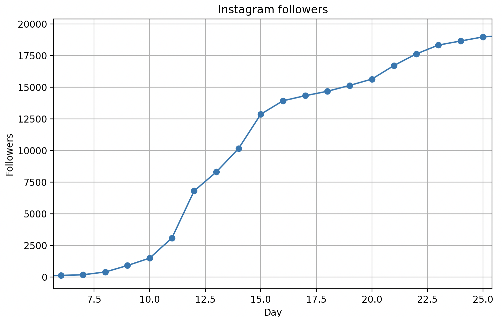
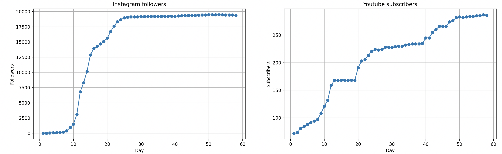
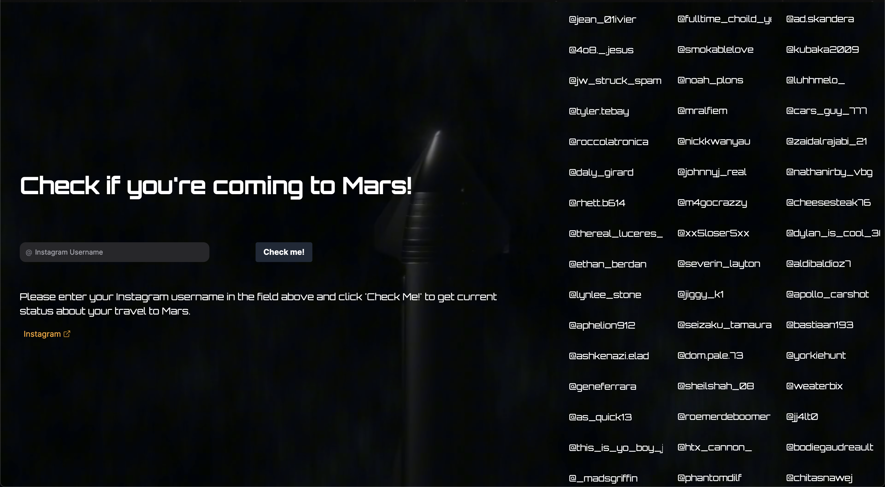
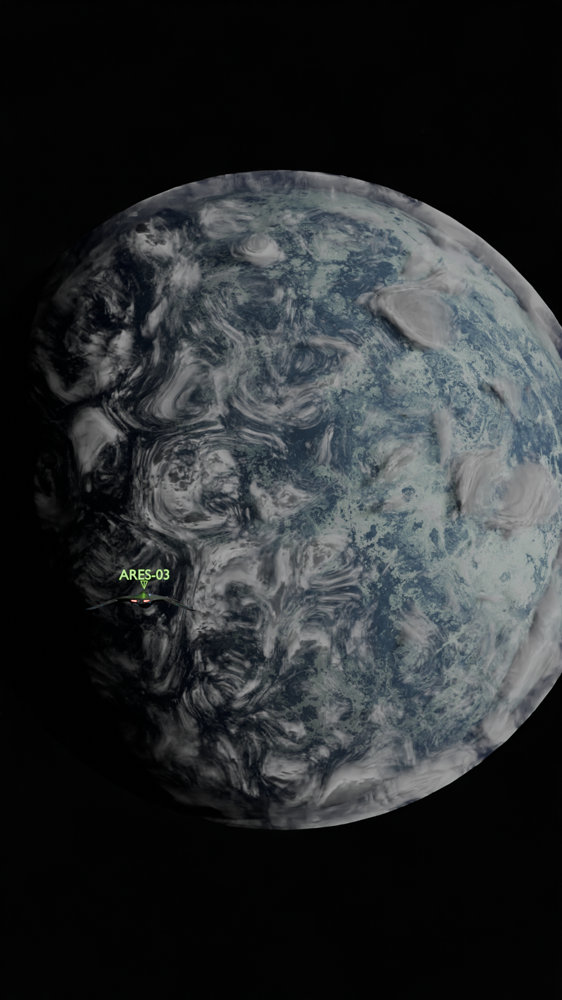

+++
title = "Integrity of Stellar | Case Study"
date = "2024-09-10"
+++

# Integrity of Stellar 
IoS - Virtual Aerospace Agency with the city on Mars

Main idea of the project is to create a virtual aerospace agency that will provide an opportunity to explore the universe and the city on Mars to everyone who has a computer or a smartphone.

Our mission is to democratize access to cutting-edge space technology and exploration tools. Through innovative projects and collaborations, we aim to push the boundaries of what is possible in space exploration and beyond.
Our Current Projects:
- The Universe Vault - portal that contains information about our planets, moons, solar-systems, stars, galaxies in The Universe 
- StellarNet: Our unique space network that connects different regions of the universe with advanced relays and stations, enabling seamless communication and exploration.
- StellarCity: A bustling metropolis on Mars, serving as the hub of our operations and a symbol of humanity's potential for interplanetary living.
- Game Development: We are currently developing an exciting new game where players take on the role of an important agency space operator, exploring the universe, discovering its secrets, and expanding the StellarNet network.

Our Goals
- Innovate: Continuously develop and integrate the latest space technology into our projects.
- Educate: Provide educational resources and interactive experiences to inspire the next generation of space enthusiasts.
- Collaborate: Foster a community of like-minded individuals and organizations to share knowledge and achieve common goals.

### Tech Stack
- Blender 
- Davinci Resolve
- Zola
- Python
- Next.js

## StellarCity
StellarCity is a city on Mars that is built by the agency and is a place where you can live, work, and explore the universe, all you have to do is subscribe to the agency Instagram or Youtube channel and your journey will begin.

### *1 follower = 1 house and citizen (Stellarian) of StellarCity*

Quick Links:
- [Instagram](https://www.instagram.com/integrityofstellar/)
- [Youtube](https://www.youtube.com/@IntegrityofStellar/)
- [Github](https://github.com/integrityofstellar) - well because I'm a developer and I like to have a repository for everything xD

## Case Study 
Project was started on 19th of March 2024, and was 'closed' 52 days later(technically later because I've still posted a few videos in different format) on 9th of May 2024.

During life of the project - 56 videos were produced, and `20k` followers were gained on Instagram. and around `300` on Youtube.

### Timeline
Due to the kind of a following model (you have to subscribe to help city grow) the followers were growing rapidly, and the project was gaining more and more attention.  
But the highest growth was between day 7 and 25:

New `17.5k` followers were gained during this period.    

This was a massive wave of new people, no one expected that the project will grow so fast.

Here is a graph of the followers during the whole project:


I had to make a [small application](https://github.com/integrityofstellar/stellarcitytracker-cli) to track the followers, because it was hard to do it manually after the first week.  
Here is an example of the usage of the application:
```bash
» python main.py 16719 203
Statistic for day 22 saved successfully

Total: 16922 (+500)

Instagram: 16719 (+250)
Youtube: 203 (+250)
```


#### More and more people and ideas
During the project I've received a lot of messages, and ideas from the followers, and I've decided to implement some of them:
- I've started a small contest for the best idea for the new building in StellarCity
- Over the first week of the project people received custom houses, castles, art studios, rocket pods, simply put a flag on the house and many more

  However at some point I had to stop this, because it was hard to keep up with the demand and some of the ideas were too complex to implement or simply (absurd) didn't fit the city.  
  Example of these not fitting ideas:
  - A house with a pool
  - Eiffel Tower
  - Big Ben Tower
- Custom Businesses. Big city == a lot of habitats, people need entertainment, some way to make money. So Stellarians were able to create their own businesses in the city, and I've decided to implement a few of them, and they were:
  - Coffee Shop
  - Bakery
  - Bookstore
  - Art Studio
  - Rocket Pod
  - Observatory

  This was a great idea, and I've decided to keep it for the future, and I'm planning to implement more businesses in the city, to keep it more alive.

  The process of creating a business was simple, you had to submut the google form with the idea, all details and the Instagram page(where you will post about your business), then once idea was acceped and implemented - it was added to the city map, and received unique TAX number, and the owner was able to start making money.  

  I did't want to make it too complex, but didn't want to use spreadsheets, so I've created a [small website](https://stellarcity-db.vercel.app/firms/) using Zola that was showing all businesses, and their TAX numbers, etc

  At this point I've had massive inspiration and will to keep the project alive, and scale it up, so the website was inteded to be a place where people can see all businesses, manage it, and see the city map, read the news, etc. But it didn't happen.


As there was high growing trends - a lot of people were expecting to get their house right now and right here, so the [new website](https://amionmars.vercel.app/) (yes again!) was created, where people were able to see the progress of their traveling

### Going to Aurora  
The project was growing, I had to keep up with the demand, and we found the new planet - Aurora(the name was chosen by the followers) that lately was explored by the agency, and volunteers from StellarCity.  
</img>  

### Audience
The audience was mostly young people(kids), who were interested in space, and wanted to be a part of something big, and they were:
- 60% from the US (for some reason)
- 37% from Europe
- 3% from the other parts of the world

Ages:
- 10-15 - 35%
- 18-25 - 50%
- 25+ - 15%

Overall the project was a success, and I'm happy that I've started it.