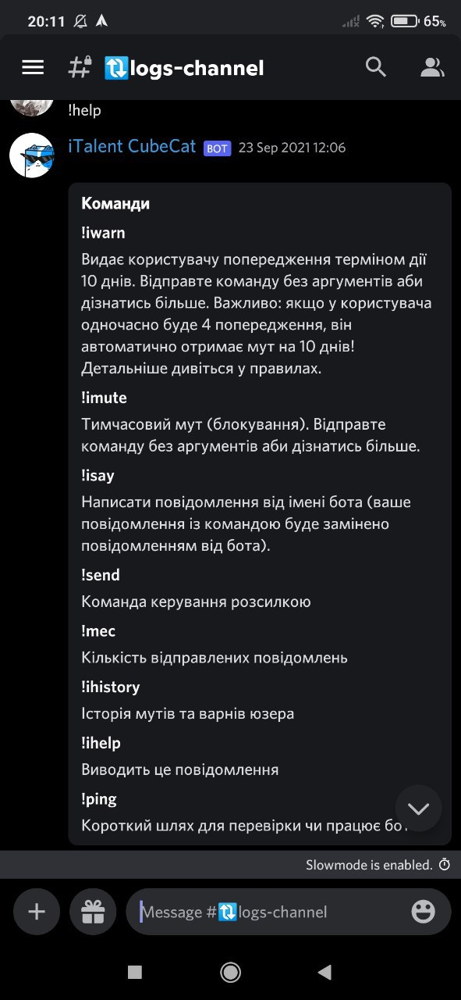
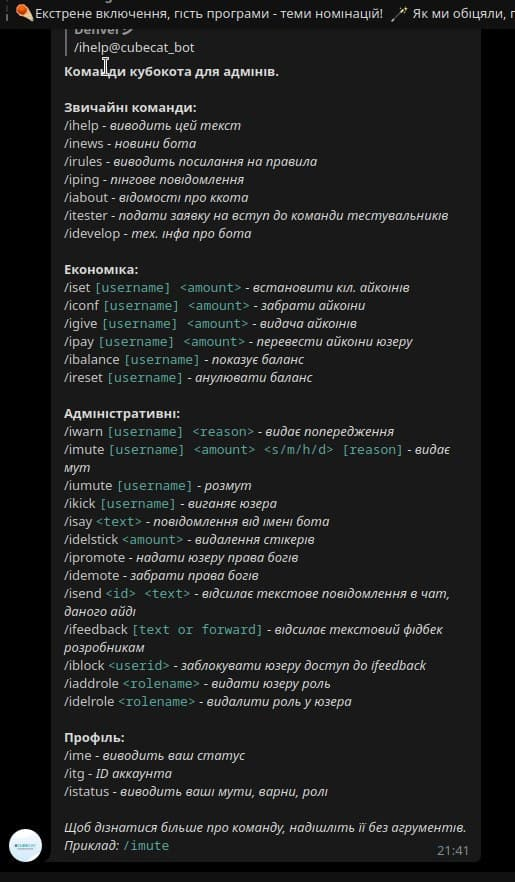

+++
title = "Cubecat/Кубокіт"
date = "2023-12-15"
description = "Chat-bot for italent.org.ua"
weight = 1
[extra]
local_image = "/projects/cubecat/cover.png"
+++

Chat-bot for helping moderators on iTalent on both Discord and Telegram platforms.

## Demo
_Note!: there's only screenshots of /help function which list all functionality in 🇺🇦 language._  
</img>
</img>

Feel free to request demo for more information.