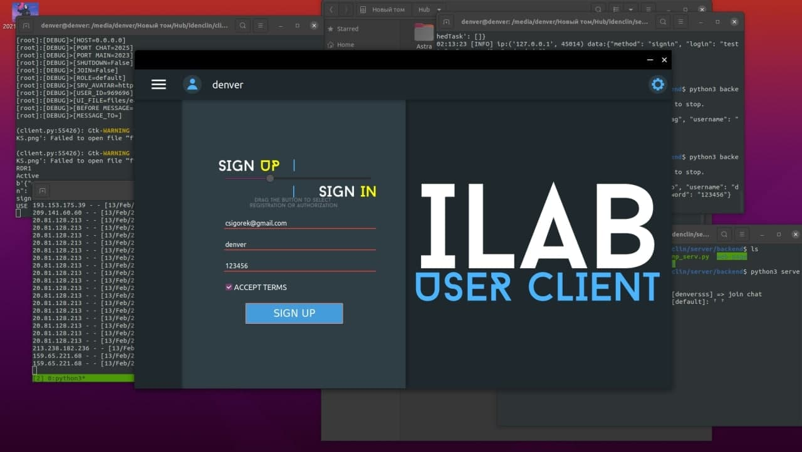
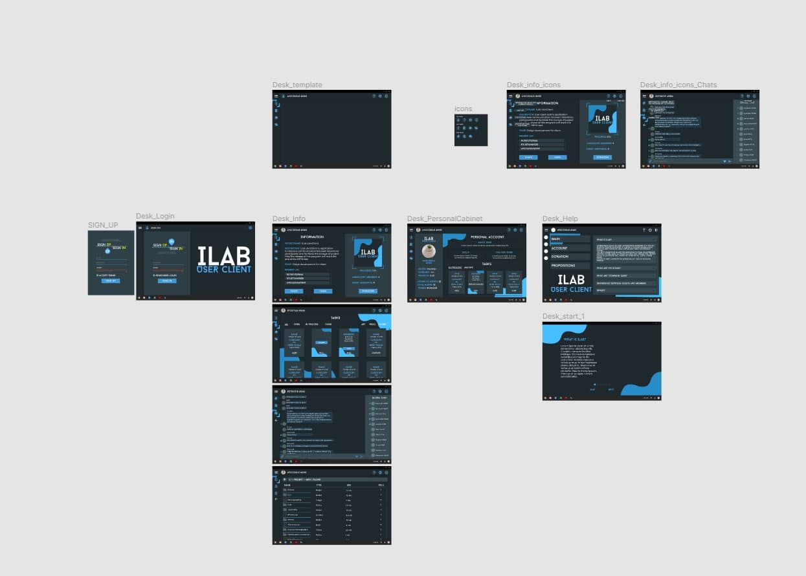
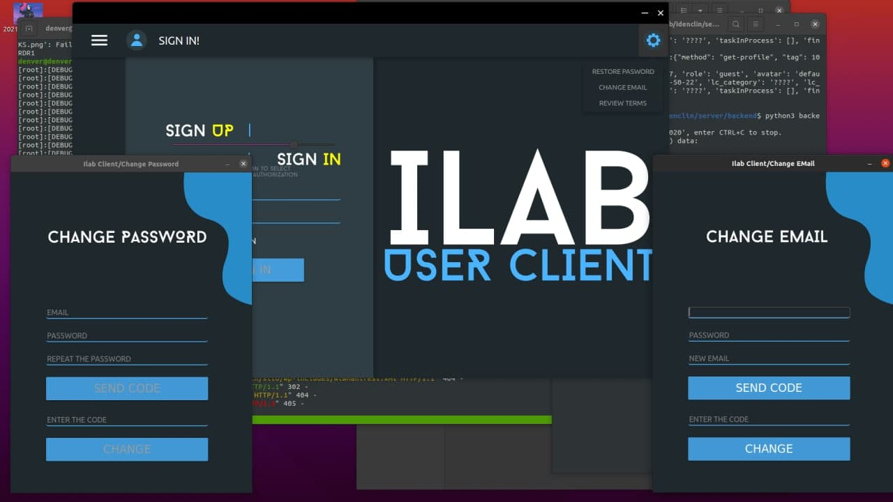
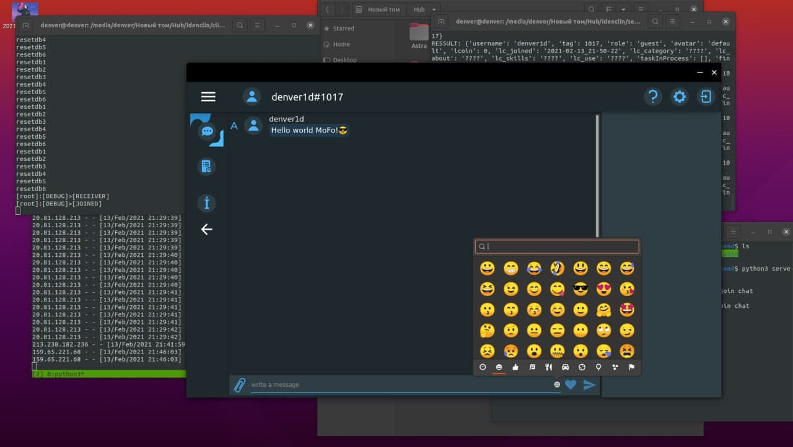
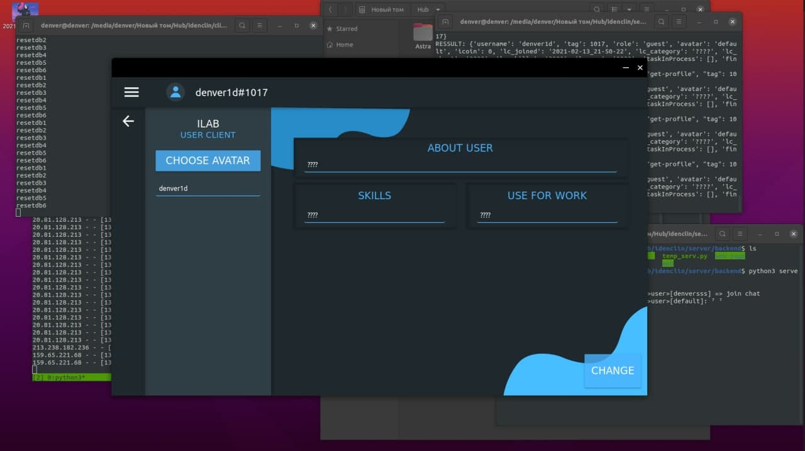
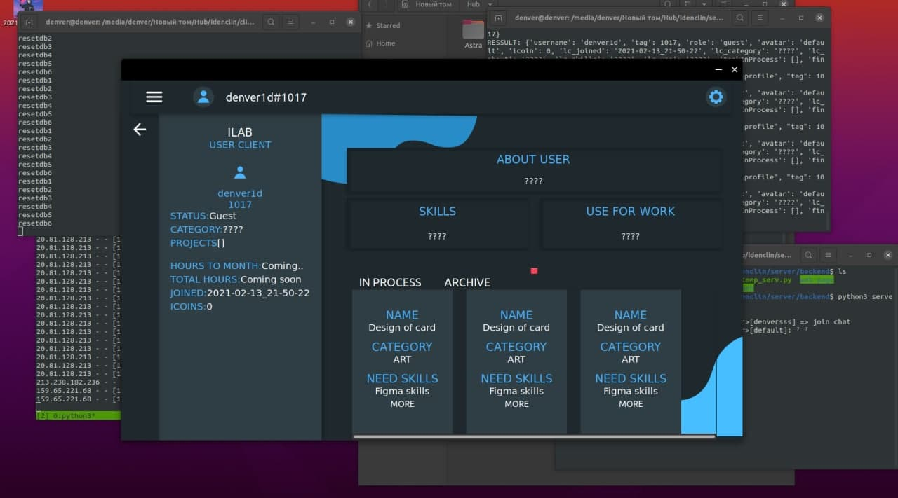
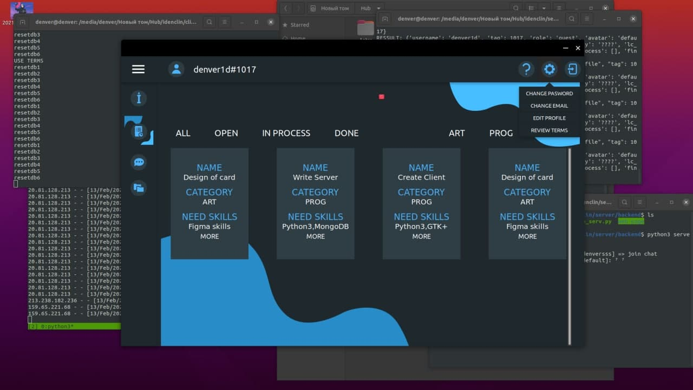
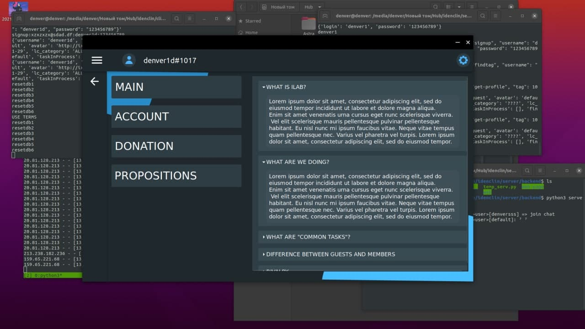

+++
title = "iLab"
description = "iLab User Client is application for improve communication between labaratory participants and faciliate the storage of project files."
weight = 5
[extra]
local_image = "/projects/ilab/ilab_2.jpg"
+++

iLab User Client is application for improve communication between labaratory participants and faciliate the storage of project files.

People finder app to create shared projects or help create them with payment in iCoins:
-   People with experience
-   Organization of the process
-   Convenient interface
-   Your file cloud

## Demo

</img>
</img>
</img>
</img>
</img>
</img>
</img>
</img>