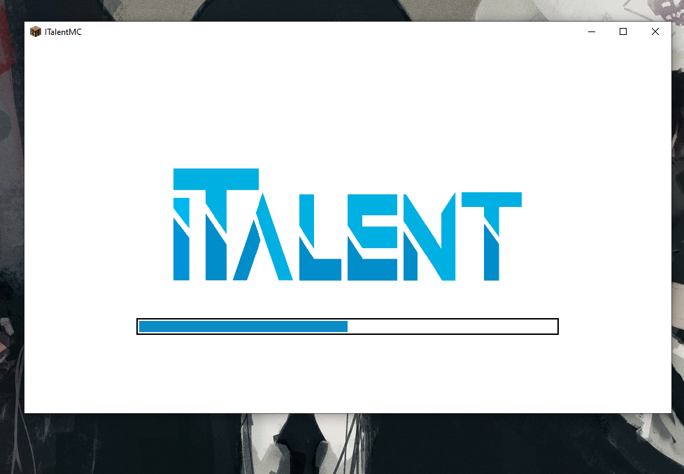

+++
title = "iTalentMC - Minecraft Server"
description = "iTalentMC is a client for minecraft server of iTalent service, with platform integration. minecraft.italent.org.ua"
weight = 3
[extra]
local_image = "/projects/italentmc/image-1.png"
+++

iTalentMC is a client for minecraft server of iTalent service, with platform integration. minecraft.italent.org.ua.
Which offers a lot of features, such as:
- Custom plugins
- Custom resource pack
- Custom map
- Web-Platform with server integration
- Custom launcher with auto-updates, profile editor and mod loader
- Custom Minecraft client with custom authorisation, server integration and redesigned UI
- Custom OAuth2 server for authorisation to use `online_mode=true`

## Demo
</img>
</img>
</img>
</img>
</img>
</img>
