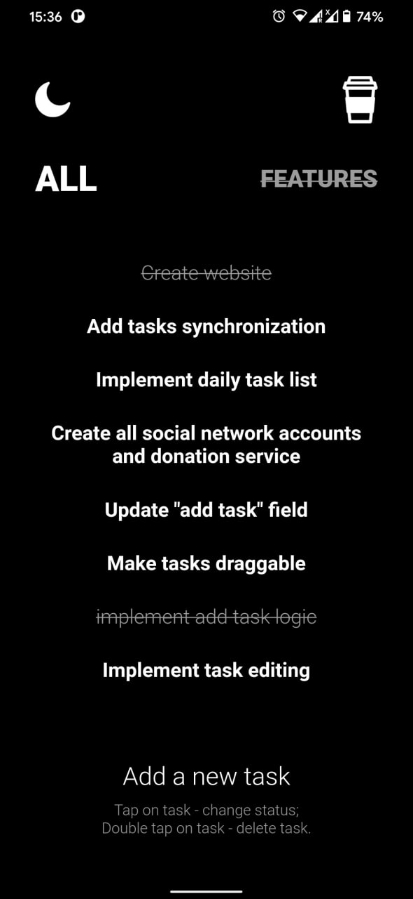
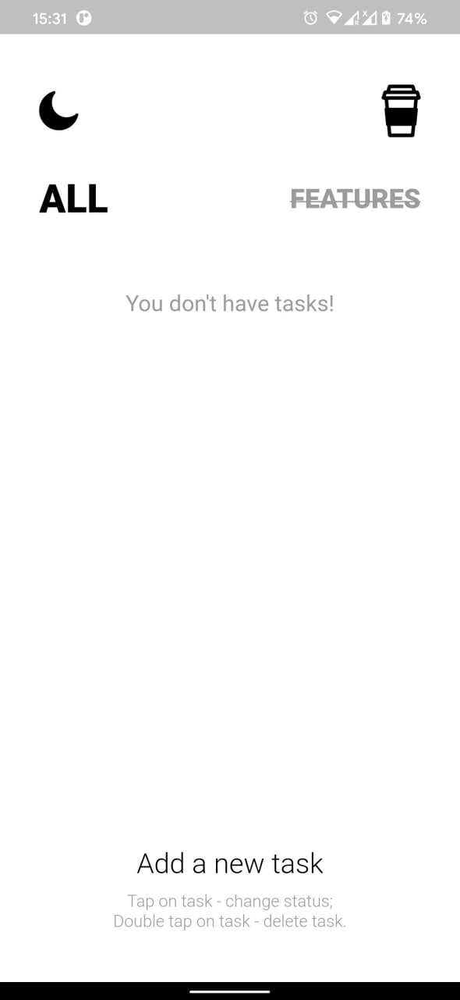
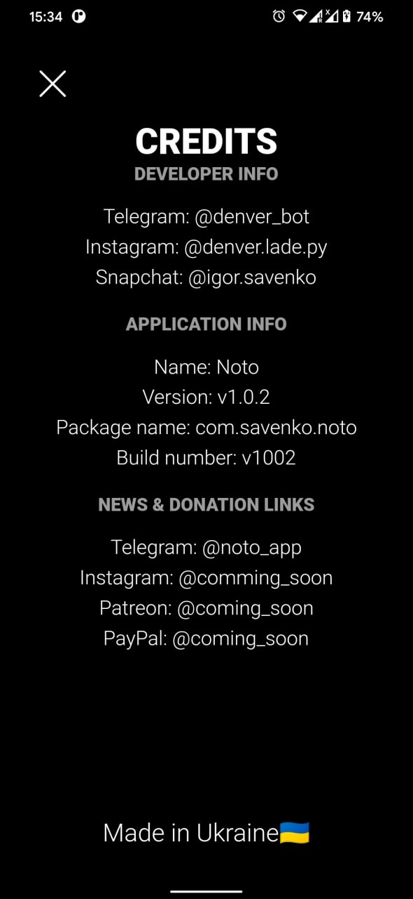
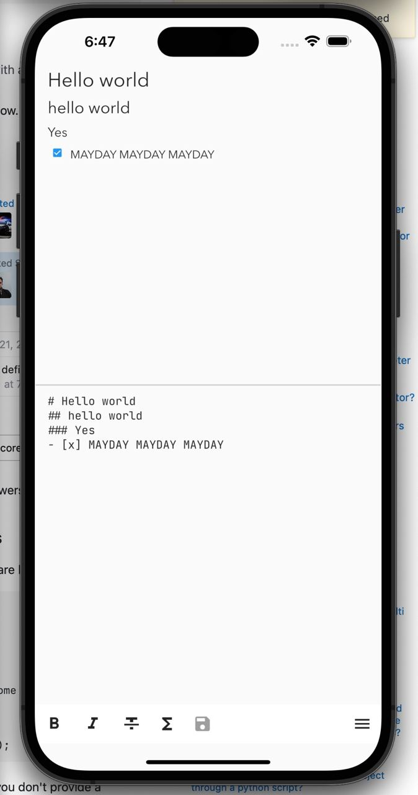

+++
title = "Noto - No Tomorrow"
description = "Noto (No Tomorrow) - this is a simple, minimalist application that will help you organize your workflow."
weight = 3
[extra]
local_image = "/projects/noto/cover.jpg"
+++

Description
Noto (No Tomorrow) - this is a simple, minimalist application that will help you organize your workflow.
Here you can add tasks, change them, change their status, delete them, assign them to be completed on a particular day, or simply to a continuous list of functions, or you can make a shopping list so that you don't forget anything in the store.

What you can do now?
- add new tasks
- change their checking status
- delete tasks

What do I want to add in the future? aka ToDo
- Add tasks synchronization with the account
- Implement a daily task list
- Update the "add task" field, make it easiest and look more beautiful
- Make tasks draggable
- Implement task editing

</img>
</img>
</img>
</img>
<video controls width="250px">
      <source src="record.mp4" type="video/mp4">
      Your browser does not support the video tag.
</video>

