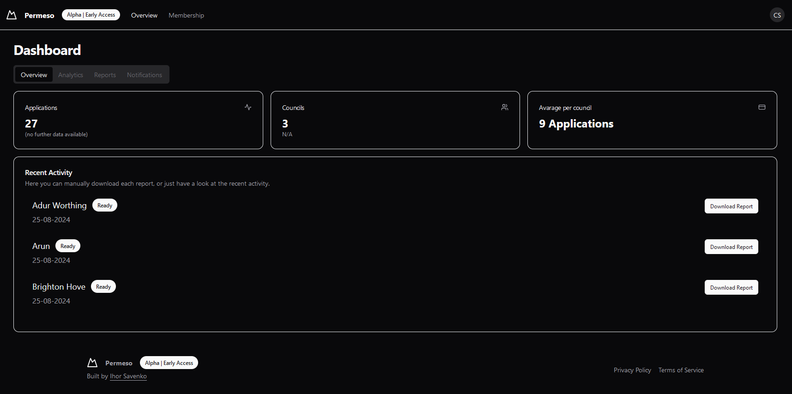

+++
title = "Permeso"
description = "Permeso - a small portal that will let you get latest Planning Applications from the councils website!"
weight = 0
[extra]
local_image = "/projects/permeso/cover.png"
+++

# Description
**Permeso** comes from Esperanto/Spanish/Italian combined, means permission, and I think this is a good name!

Eventually this is a `parser`, but in fact this is a whole `Platform`, or someone calls it a `portal` where you can manage your subscription and get the latest data from the selected councils  
_(because why would you need data from all of them?)_.  
</img>
# What applications?  
Well, it depends, but if you don't know - UK Councils have separate platform where you can put application and it will be reviewed by someone.  
This application contains Proposal (what you want to do, this could be renovation, extension or even tree surgery) and your address(_you might get already where it goes_)

# Why?  
Small Agencies/Companies always need some clients, but because they small, or even medium - they not very popular, which make an loop for them, as `referal` system not working as it could.  
So, they would be ending up with something like a `Website`, `Social Media` advertisement, and banners in local area.  
And this might be good source of new clients, therefore you might want to get even more potential clients!  

Here comes the planning applications, all of these people will need someone like this agency to build or fix their stuff, potentially they know someone and will work with them, but you always will have a chance to make business with them.  

### What this agencies do with planning applications?
It depends on agency, but mostly they will cold mail a letter with content like:  
_Hey! We're XYZ company based near your ABCD1234 property and can help with doing X thing!_  
Which is a spam for those people in most cases, but even 1 sucessfull contact out of 20 applications is already amazing, because you already have `1` potential client(as this client likely still waiting for application decision) that might come back to you later or even recommend your `XYZ` company to a friend.

# How?
## Tech Stack
- `NextJS` as frontend framework
- `FastAPI` as a backend framework

- `MongoDB` as a main database
- `PostgreSQL` for Umami analytics 

- `Stripe` for payments
- `Firebase/auth` for authorization

- Linux-based `VPS` for hosting a backend (Includes `CI/CD`)
-` Umami.is` for analytics
- `Vercel` for Front-end, Umami Instance and PostgreSQL hosting
- `Shadcn/ui` as a components library for the NextJS
- `Cloudflare` for `SSL` and protection
- `Docker` for virtualization and rapid deployments

# Real-time deployment
Unlikely you will be able to experience all features of the platform without subscription, so you can <a href="https://www.youtube.com/watch?v=t2iSe9blRu8">watch this video</a>  
<iframe width="600" height="300" src="https://www.youtube.com/embed/t2iSe9blRu8" title="Permeso #4 | Redesign! | NextJS Firebase Fastapi Stripe  Shadcn/UI" frameborder="0" allow="accelerometer; autoplay; clipboard-write; encrypted-media; gyroscope; picture-in-picture; web-share" allowfullscreen></iframe>  

Slighly update version:
<iframe width="600" height="300" src="https://www.youtube.com/embed/gWflNJPjxhc" title="Permeso #4 | Redesign! | NextJS Firebase Fastapi Stripe  Shadcn/UI" frameborder="0" allow="accelerometer; autoplay; clipboard-write; encrypted-media; gyroscope; picture-in-picture; web-share" allowfullscreen></iframe>  

- Production: [offline.permeso.ihorsavenko.com](https://offline.permeso.ihorsavenko.com)

# What's next?
- A while after a fork of Permeso became a `Planning portal` that does exactly the same things but built for organisations that will be selling this data to the agencies. <iframe width="600" height="300" src="https://www.youtube.com/embed/CEdgkTXSbhI" title=" Planning Portal MVP Demo" frameborder="0" allow="accelerometer; autoplay; clipboard-write; encrypted-media; gyroscope; picture-in-picture; web-share" allowfullscreen></iframe>  
- Also Permeso-portal are now open source, so you can check it out on [GitHub](https://github.com/denver-code/permeso-portal)
- Stage and Production version will be merged into one (stage will be main) and will be separated from backend to demonstrate how it works and used as a demo for potential clients.

# Source code
Not publicaly available (*yet*, in case I'll decide to), but if you would like to get it or have a look at separate functions - let me know via email:  
`contact@ihorsavenko.com` or `csigorek@gmail.com`  
Please include as much details as you can about you, your company(if applicable) and reason of interest. 